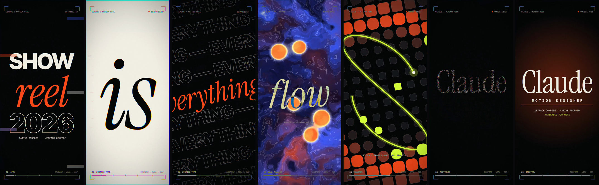

# Motion Showreel

A 15-second, looping motion-design showreel that runs as a native Android app. Every frame is drawn live in Kotlin on a Jetpack Compose `Canvas`, with two AGSL shaders on the GPU. There's no video file, no Lottie, no web view, and no keyframes: the whole reel is a pure function of time.

Designed and built with **Claude Opus 5.5** in [Claude Code](https://claude.com/claude-code).

[](https://github.com/c5inco/motion-showreel/releases/download/v1.0/showreel.mp4)

**▶ [Watch the reel (MP4, 15 s, 60 fps)](https://github.com/c5inco/motion-showreel/releases/download/v1.0/showreel.mp4)**: a capture from the Android emulator, attached to the [v1.0 release](https://github.com/c5inco/motion-showreel/releases/tag/v1.0).

## The reel

| Time | Section | What happens |
|---|---|---|
| 0–2s | **00 Open** | A dot anticipates, pops with a shockwave and stretches into a line. The line splits into colour bars that wipe away to reveal *SHOW / reel / 2026*. |
| 2–4.45s | **01 Kinetic Type** | *TIMING* drops in letter by letter with squash, stretch and smear. *is* slams in on paper. *everything* scrolls in tilted marquee rows that collapse to the centre. |
| 4.45–7s | **02 AGSL Shaders** | An iris opens onto a domain-warped fluid with glass metaballs and contour lines. *flow* rides it in difference blend. The field pixelates into a grid. |
| 7–9.5s | **03 Geometry** | The pixels match-cut into ~300 shapes that morph square→circle on a radial wave, while a lissajous trim path chases across them. |
| 9.5–12.6s | **04 Particles** | 3,600 particles burst into a three-armed galaxy, arc into the letters of *Claude*, inhale, and detonate. |
| 12.6–15s | **05 Identity** | The serif lockup lands with a flash and a light sweep. *MOTION DESIGNER* tracks in, and the credits type on. An iris closes to the dot that opens the reel, so it loops seamlessly. |

A viewfinder overlay runs on top throughout: timecode, REC dot, rolling section labels and a progress bar. It's drawn in difference blend so it stays readable on both ink and paper.

## How it's built

- **One draw pass per frame.** `Reel.render(drawScope, t)` draws the whole frame from the time `t` alone. Nothing is simulated or stored between frames, which is what makes the reel loopable, scrubbable and freezable on any frame.
- **Jetpack Compose `DrawScope`** handles shapes, text, clipping, transforms, gradients and blend modes.
- **AGSL shaders** (`Shaders.kt`) run through Android's `RuntimeShader`:
  - `FLUID`: domain-warped fBm with metaballs, contour lines, an iris mask and a pixelate control.
  - `POST`: a full-frame lens pass applied as a `RenderEffect` on a `graphicsLayer`. It adds chromatic aberration that spikes on the beats, glitch slices at hard cuts, a vignette and film grain.
- **Analytic particles** (`Particles.kt`): each particle's position is a closed-form function of time. The title is rasterised once into an `ALPHA_8` bitmap to get the particles' target points. Particles are drawn as motion-blurred streaks with four `Canvas.drawLines` calls per frame (one per colour) and additive blending, so nothing is allocated per frame.
- **Typography** (`TextKit.kt`): text layouts are cached, and animated text moves with transforms instead of being re-measured each frame. Caps are centred optically using measured cap heights.
- **Global motion**: a list of impact beats in `Motion.kt` drives both camera shake and the lens aberration, so they hit on the same beats.

```
app/src/main/java/com/example/showreel/
├── MainActivity.kt   Full-screen activity, frame clock, tap to restart
├── Reel.kt           Every scene, the HUD and the post-effect wiring
├── Shaders.kt        AGSL sources (fluid + lens)
├── Particles.kt      Analytic particle system
├── TextKit.kt        Text layout cache and optical cap centring
└── Motion.kt         Palette, timeline, impact beats, easing library
```

## Running it

The app needs Android 13 (API 33) or later for `RuntimeShader`.

```sh
./gradlew :app:installDebug
adb shell am start -n com.showreel.reel/com.example.showreel.MainActivity
```

Tap anywhere to restart the reel.

**On an emulator**, use host GPU rendering (`hw.gpu.mode=host` in the AVD's `config.ini`, or `-gpu host`). Headless emulators with `gpu.mode=auto` fall back to software rendering, which drops the frame rate from 60 fps to about 20–35.

### Debug launch options

Jump to any moment, freeze it, or turn off the lens pass. This is useful for screenshots:

```sh
adb shell am start -n com.showreel.reel/com.example.showreel.MainActivity \
  --ef seek 7.2 --ez freeze true --ez nopost true
```

## Fonts

All three fonts are licensed under the [SIL Open Font License 1.1](https://openfontlicense.org), and their licences are included in [`licenses/`](licenses/):

- [Inter Tight](https://fonts.google.com/specimen/Inter+Tight) (ExtraBold): kinetic caps
- [Instrument Serif](https://fonts.google.com/specimen/Instrument+Serif) (Regular and Italic): accents and the title
- [Geist Mono](https://fonts.google.com/specimen/Geist+Mono) (Regular and SemiBold): HUD and captions

## Made with Claude Opus 5.5

Claude Opus 5.5, working in Claude Code, did the concept, choreography, typography, AGSL shaders and Kotlin for this reel. It also verified the work on the Android emulator: it froze frames at chosen timestamps to review them, profiled the frame rate, and captured the recording.

## License

The code is released under the [MIT License](LICENSE). The fonts keep their own OFL licences (see above).
